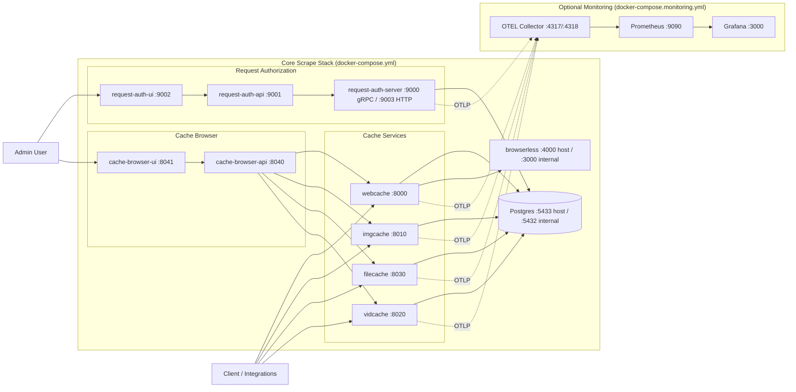

# Scrape Stack Architecture (with Optional Monitoring)

```mermaid
flowchart LR
  user[Client / Integrations]
  admin[Admin User]

  subgraph app["Core Scrape Stack (docker-compose.yml)"]
    direction LR

    subgraph cache["Cache Services"]
      webcache[webcache :8000]
      imgcache[imgcache :8010]
      filecache[filecache :8030]
      vidcache[vidcache :8020]
    end

    subgraph reqauth["Request Authorization"]
      ra_server[request-auth-server :9000 gRPC / :9003 HTTP]
      ra_api[request-auth-api :9001]
      ra_ui[request-auth-ui :9002]
    end

    subgraph browser["Cache Browser"]
      cb_api[cache-browser-api :8040]
      cb_ui[cache-browser-ui :8041]
    end

    postgres[(Postgres :5433 host / :5432 internal)]
    browserless[browserless :4000 host / :3000 internal]
  end

  user --> webcache
  user --> imgcache
  user --> filecache
  user --> vidcache

  admin --> ra_ui
  ra_ui --> ra_api
  ra_api --> ra_server
  ra_server --> postgres

  webcache --> postgres
  imgcache --> postgres
  filecache --> postgres
  vidcache --> postgres

  webcache --> browserless

  admin --> cb_ui
  cb_ui --> cb_api
  cb_api --> webcache
  cb_api --> imgcache
  cb_api --> filecache
  cb_api --> vidcache

  subgraph mon["Optional Monitoring (docker-compose.monitoring.yml)"]
    direction LR
    otel[OTEL Collector :4317/:4318]
    prom[Prometheus :9090]
    grafana[Grafana :3000]
    otel --> prom --> grafana
  end

  webcache -. OTLP .-> otel
  imgcache -. OTLP .-> otel
  filecache -. OTLP .-> otel
  vidcache -. OTLP .-> otel
  ra_server -. OTLP .-> otel
```
