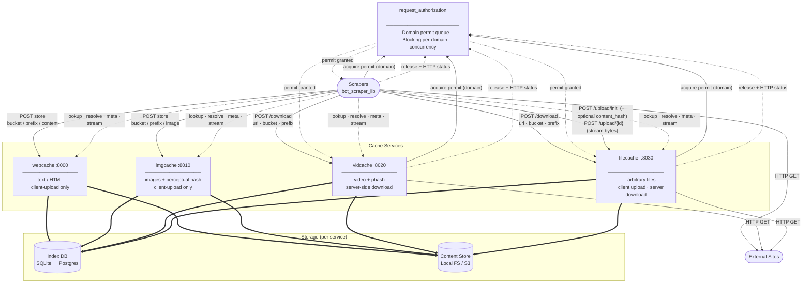

# Scraper Service Architecture

## Upload patterns

**Client-side upload** (webcache, imgcache) — the scraper acquires a permit from
`request_authorization`, performs the HTTP fetch itself, releases the permit, then
pushes the bytes to the cache service along with a pre-computed BLAKE3 `content_hash`.
The server deduplicates on the hash before writing — if the hash is already stored the
content body is ignored and `status: duplicate` is returned immediately.

**Server-side download** (vidcache, filecache `/download`) — the scraper hands a URL
to the cache service. The cache acquires the permit, performs the fetch, releases the
permit, stores the content, and returns the metadata record. The scraper never touches
the bytes.

**Two-phase client upload** (filecache/vidcache) — the scraper calls `POST /upload/init`
with a pre-computed `content_hash`. If the hash is already stored the server returns
`status: fresh` or `cached` and no bytes are transferred. Only if `status: pending` does
the scraper stream bytes to `POST /upload/{id}`.

## Content hash standard

All clients compute a BLAKE3 hash of the content before any upload call. This is the
universal dedup key across all services:

| Service | Hash sent at | Required? | Short-circuit |
| --- | --- | --- | --- |
| webcache | `POST /cache` body | yes | server ignores body if hash known |
| imgcache | `POST /cache` body | yes | server ignores body if hash known |
| filecache | `POST /upload/init` | expected | returns `fresh`/`cached`, skips upload |
| vidcache | `POST /upload/init` | expected | returns `fresh`/`cached`, skips upload |

## Storage

Each cache service maintains its own SQLite index today. The shared Postgres schema
(`cache_entries`, `url_map`, service-specific `*_meta` tables) is the migration target
that will enable the cache browser.
